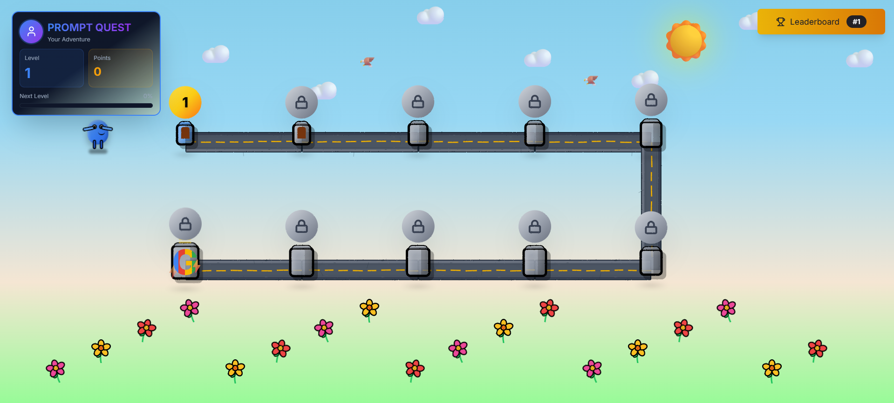

# PromptQuest

> A web-based game to learn high‑quality prompt engineering with real-time scoring powered by Google Gemini.

[▶️ Play PromptQuest Live](https://your-frontend.vercel.app)  
Backend API: https://promptquest-backend-xxxx-uc.a.run.app (replace with your Cloud Run URL)



## Tech Stack
- Frontend: Vite, React, TypeScript, Tailwind, Radix UI
- Backend: Python, Flask, Flask‑CORS, google‑generativeai
- Infra (final): Frontend on Vercel (static), Backend on Google Cloud Run (Docker + Gunicorn)
- Dev tooling: Node.js, npm, Python 3.11, `python-dotenv`

## Work Cycle (What We Tried → What Worked)
1) Single-project serverless on Vercel
	 - Approach: Put Python under `api/` and route `/api/*` to a serverless function.
	 - Issues: Local `vercel dev` on Windows needed a system Python; path/link conflicts, runtime config errors, and project root mis-linking caused 502s.
2) Split hosting: Vercel (frontend) + Render/others (backend)
	 - Approach: Static frontend on Vercel; long-lived Flask API on another host.
	 - Result: Works, but added an extra platform and longer cold starts at times.
3) Final architecture (recommended)
	 - Frontend: Vercel static site (Vite build → `dist/`).
	 - Backend: Google Cloud Run with a small Docker image running Gunicorn.
	 - Why: Simple, reliable, easy environment variables, and zero serverless quirks. Clear `VITE_API_BASE_URL` to a single stable backend URL.

## Repository Layout
```
.
├── Backend/             # Flask API, Dockerfile, requirements.txt
├── Frontend/            # Vite React app (TypeScript), package.json
├── assets/              # Repo assets (README images, etc.)
├── DEPLOYMENT.md        # Detailed deploy steps (Vercel + Cloud Run)
├── vercel.json          # Root Vercel config (optional, if deploying Frontend/ directly)
└── README.md
```

## Local Development (Split)
Backend
```cmd
cd Backend
python -m venv .venv
.venv\Scripts\activate
pip install -r requirements.txt
copy .env.example .env
# Set GEMINI_API_KEY in .env
python app.py  # http://localhost:5000
```
Frontend
```cmd
cd Frontend
npm install
copy .env.example .env   # VITE_API_BASE_URL=http://localhost:5000
npm run dev              # http://localhost:5173
```

## Production Deployment
Backend (Cloud Run)
```cmd
cd Backend
gcloud auth login
gcloud config set project <PROJECT_ID>
gcloud config set run/region <REGION>
gcloud builds submit --tag gcr.io/<PROJECT_ID>/promptquest-backend
gcloud run deploy promptquest-backend ^
	--image gcr.io/<PROJECT_ID>/promptquest-backend ^
	--platform managed ^
	--allow-unauthenticated ^
	--set-env-vars GEMINI_API_KEY=<YOUR_KEY>
```

Frontend (Vercel)
- Project root: `Frontend/`
- Environment Variables:
	- `VITE_API_BASE_URL = https://<your-cloud-run-service>.a.run.app`
- Build: `npm install`, `npm run build`, Output: `dist` (SPA fallback to `index.html` is configured)

## Environment Variables
- Backend: `GEMINI_API_KEY` (Cloud Run env var; never commit secrets)
- Frontend: `VITE_API_BASE_URL` (set on Vercel; compile-time for Vite)

## Technical Retrospective
- Serverless Python locally on Windows can be brittle (PATH, runtime detection). A containerized Flask on Cloud Run was smoother and more predictable.
- Keep frontend and backend clearly split; point the app via `VITE_API_BASE_URL`.
- Never store API keys in frontend `.env` files in Git; use platform env vars.
 - Attempts summary:
	 - Vercel serverless (Python under `api/`): simple in theory, but local dev and runtime config were flaky on Windows; routing required careful `vercel.json` hygiene.
	 - Split with Render: workable but added platform overhead and occasional cold‑start delays.
	 - Final: Vercel (static frontend) + Cloud Run (containerized backend) provided the most reliable DX and production stability.

For step-by-step commands and troubleshooting, see `DEPLOYMENT.md`.
